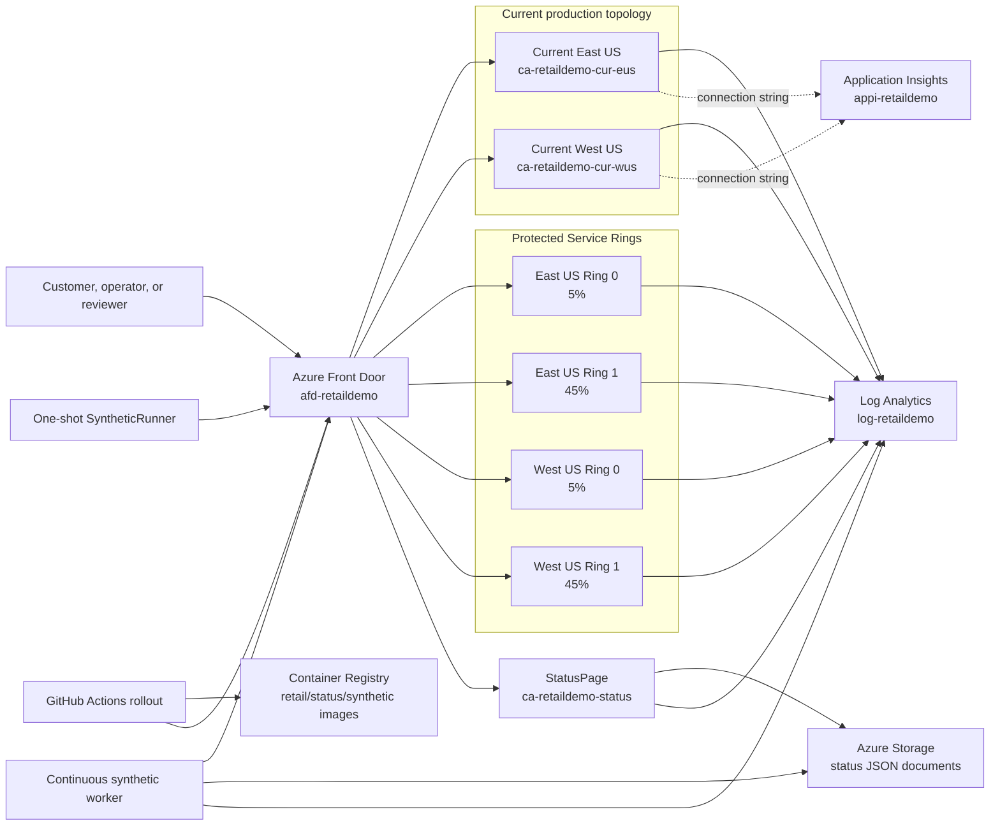
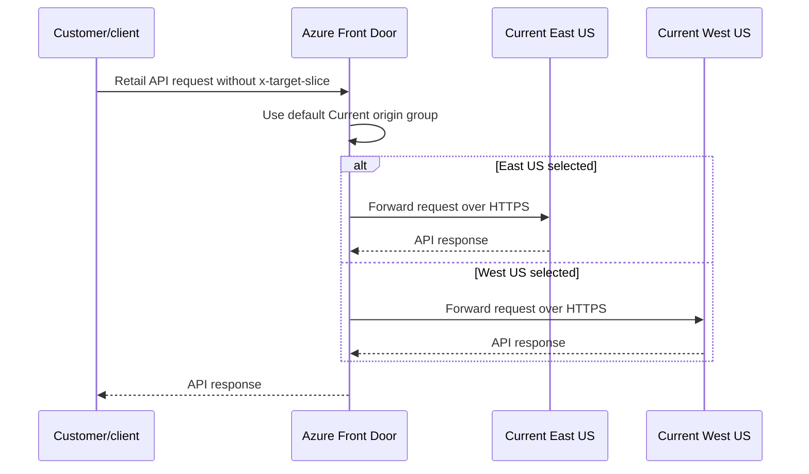
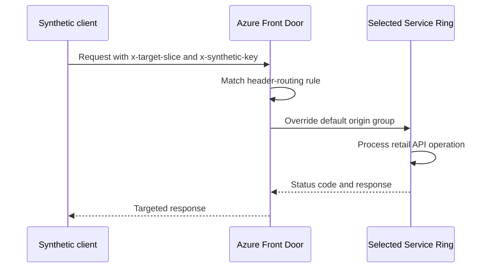
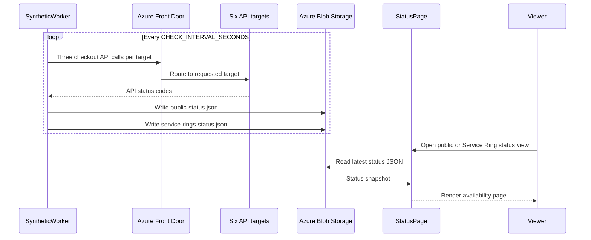
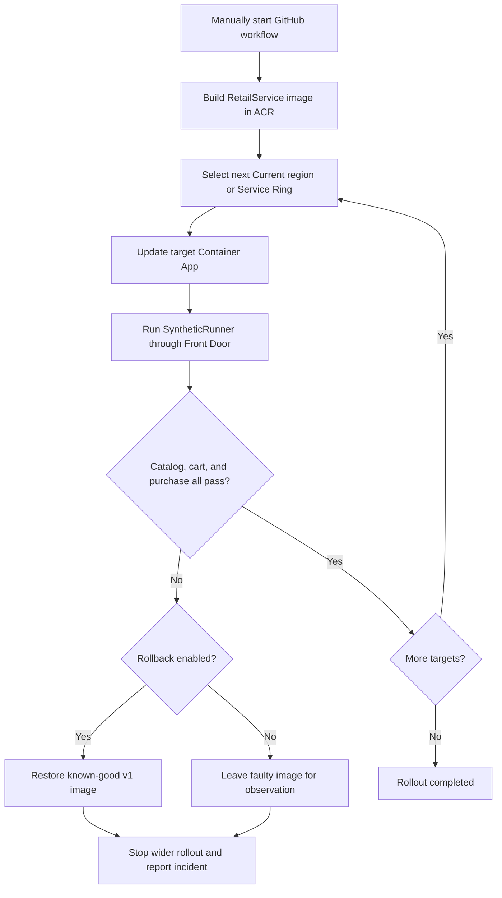

# CloudMain Retail API, Synthetic Transactions, and Service Ring Architecture

**Repository:** `sanjayraghani/cloudmain`

**Solution folder:** `demo-dotnet`

**Azure subscription:** `AzureMain` (`9b11704c-1b3b-4688-94b0-805459ccf099`)

**Primary resource group:** `rg-cloudmain-retail-demo`

**Inventory reviewed:** 28 July 2026

## 1. Purpose of this document

This document reconstructs the background and intent of the CloudMain retail
demonstration. It explains:

- the retail API;
- the manual and continuous synthetic transaction clients;
- the Current and Service Ring deployment models;
- Azure Front Door routing;
- the public and operator status pages;
- the rollout and rollback workflows;
- the infrastructure-as-code and lifecycle scripts;
- every resource observed in the Azure resource group; and
- known differences between live Azure and the repository.

This is an architecture and component handbook. It does not prescribe the final
cost-reduction changes. Cost optimization should follow after the components and
their required behavior have been reviewed.

## 2. Executive summary

CloudMain is a deployment-safety demonstration built around a small retail
checkout API. The same API is deployed several times:

- two **Current** instances represent normal East US and West US production;
- four **Service Ring** instances represent progressively wider protected
  deployment slices; and
- a deliberately faulty version, `Patch 2`, demonstrates how synthetic checkout
  validation can detect a purchase regression and stop a rollout.

Azure Front Door is the public routing layer. Ordinary traffic goes to the two
Current applications. Synthetic or rollout-validation traffic carries an
`x-target-slice` header, allowing Front Door to send a request to one named
region or Service Ring. The application also receives an `x-synthetic-key`
header intended to protect targeted synthetic access.

A continuous synthetic worker checks the catalog, cart, and purchase sequence
against the Current and Service Ring targets. It writes summarized status
documents into Azure Storage. A separate status-page application reads those
documents and presents public and Service Ring views.

GitHub Actions can build a patch image, deploy it to one target at a time, run
the checkout synthetic through Front Door, and stop or roll back when validation
fails.

## 3. High-level block diagram



## 4. The central demonstration story

The demonstration answers this question:

> How can a software team deploy a retail-service patch gradually, test the
> complete checkout journey against a specific deployment slice, and stop or
> roll back before a faulty patch reaches wider traffic?

The intended scenario is:

1. Build a new `RetailService` container image.
2. Deploy it to the smallest selected target.
3. Send a targeted synthetic checkout through Azure Front Door.
4. Validate `GetItem`, `AddItemToCart`, and `PurchaseItem`.
5. If all steps pass, move to the next target.
6. If any step fails, stop the rollout.
7. Optionally restore the failed target to a known-good `v1` image.

`Patch 2` intentionally fails the purchase operation. It exists to make the
health gate and rollback behavior visible during a demonstration.

## 5. Request and data-flow diagrams

### 5.1 Ordinary retail request



### 5.2 Targeted synthetic request



### 5.3 Continuous status generation



### 5.4 Patch rollout and health gate



## 6. Repository map

| Path | Component | Purpose |
|---|---|---|
| `demo-dotnet/src/RetailService` | Retail API | Implements catalog, cart, purchase, root, and health endpoints |
| `demo-dotnet/src/SyntheticRunner` | One-shot synthetic | Runs one checkout against a selected target |
| `demo-dotnet/src/SyntheticWorker` | Continuous synthetic | Repeatedly tests all targets and writes status snapshots |
| `demo-dotnet/src/DemoControl` | Local rollout simulator | Models rollout order, health gates, and rollback decisions |
| `demo-dotnet/src/StatusPage` | Availability UI | Serves public and Service Ring status views |
| `demo-dotnet/tests/RetailService.Tests` | Automated tests | Tests retail behavior and health endpoints |
| `demo-dotnet/infra/main.bicep` | Main Azure template | Defines shared services, environments, and Container Apps |
| `demo-dotnet/infra/modules/front-door.bicep` | Front Door module | Defines the repository's intended Front Door topology |
| `demo-dotnet/infra/parameters` | Operating modes | Defines dormant and active-demo replica settings |
| `demo-dotnet/infra/scripts` | Lifecycle commands | Validates, deploys, starts, stops, and destroys the environment |
| `.github/workflows` | Delivery automation | Builds, deploys, tests, rolls back, and deploys the root static site |
| `demo-dotnet/docker-compose.yml` | Local containers | Runs RetailService and StatusPage locally |

There is also an older Node/npm prototype elsewhere in the repository. The
architecture in this document concerns the .NET solution under `demo-dotnet`.

## 7. RetailService

### 7.1 Responsibility

`RetailService` is a minimal ASP.NET Core API. It is deliberately small so the
deployment behavior is easier to demonstrate than the business logic.

It stores all data in process memory. Restarting or replacing a replica clears
carts and purchase history. That is acceptable for this demonstration but is not
a production persistence model.

### 7.2 Configuration

| Setting | Meaning |
|---|---|
| `Demo__Region` | Logical region reported by `/health`, such as `eastus` |
| `Demo__Slice` | Logical target, such as `eastus-ring0` |
| `Demo__Version` | Application version or patch behavior |
| `Demo__SyntheticKey` | Key supplied to targeted synthetic clients |
| `APPLICATIONINSIGHTS_CONNECTION_STRING` | Intended telemetry connection |

### 7.3 Version behavior

| Version | Behavior |
|---|---|
| `v1` / `Patch 1` | Catalog, cart, and purchase succeed |
| `Patch 2` / `patch-2` | Purchase returns HTTP 500 |
| `Patch 3` | Catalog, cart, and purchase succeed |

Only the purchase endpoint checks `PatchBehavior.IsBuggy`. This isolates the
fault to the last and most important step of the synthetic journey.

## 8. API reference

### 8.1 `GET /`

Returns a basic service-identification response.

Example:

```json
{
  "name": "CloudMain Retail Observability Demo",
  "service": "RetailService",
  "status": "Retail APIs ready"
}
```

### 8.2 `GET /health`

Reports the identity of the deployed instance.

Example:

```json
{
  "ok": true,
  "service": "RetailService",
  "region": "eastus",
  "slice": "eastus-ring0",
  "version": "v1"
}
```

This is an instance-identity and process-health check. It does not test storage,
Front Door, checkout behavior, or another dependency.

### 8.3 `GET /items/{id}`

Retrieves one catalog item.

Seed items:

| Item ID | Name | Price |
|---|---|---:|
| `sku-100` | Azure Trail Shoes | 129.00 |
| `sku-200` | Observability Backpack | 89.00 |
| `sku-300` | Rollback Hoodie | 59.00 |

Success returns HTTP 200 and the item. An unknown item returns HTTP 404:

```json
{
  "error": "Item not found"
}
```

### 8.4 `POST /cart/items`

Adds an item to an in-memory cart.

Example request:

```json
{
  "cartId": "synthetic-cart-123",
  "itemId": "sku-100",
  "quantity": 1
}
```

Behavior:

- a missing or blank `cartId` causes the API to create one;
- a quantity less than or equal to zero becomes `1`;
- an unknown item returns HTTP 404; and
- a successful add returns HTTP 200 with the resulting cart.

### 8.5 `POST /purchase`

Purchases the current contents of a cart.

Example request:

```json
{
  "cartId": "synthetic-cart-123",
  "customerId": "synthetic-customer"
}
```

Outcomes:

| Condition | Response |
|---|---|
| Cart does not exist | HTTP 404 |
| Cart is empty | HTTP 400 |
| `Demo__Version` is Patch 2 | HTTP 500 problem response |
| Valid cart on healthy version | HTTP 200 with purchase |

On successful purchase, the cart is removed and a purchase record is retained
in memory.

## 9. Retail data entities

| Entity | Important fields | Lifetime |
|---|---|---|
| `Item` | ID, name, price | Seeded when each process starts |
| `CartLine` | Item ID, quantity | Retained inside an in-memory cart |
| `Cart` | Cart ID, collection of lines | Until purchase or process restart |
| `Purchase` | Purchase ID, cart ID, customer ID, lines, timestamp, version | Until process restart |
| `ApiError` | Error text | One response |
| `PurchaseResult` | Status and optional purchase | One purchase attempt |

There is no database resource in Azure because the demonstration does not use
durable retail data.

## 10. SyntheticRunner

### 10.1 Responsibility

`SyntheticRunner` is a one-shot command-line client used by developers and
GitHub Actions. It executes one complete checkout:

```text
GetItem -> AddItemToCart -> PurchaseItem
```

The process exits successfully only when all three operations return a 2xx
status. A non-zero exit code makes a GitHub Actions health-gate step fail.

### 10.2 Inputs

| Argument | Meaning |
|---|---|
| `--url` | RetailService or Front Door base URL |
| `--item` | Item to purchase; default is `sku-100` |
| `--target-slice` | Optional region or Service Ring |
| `--synthetic-key` | Optional secret for protected targeting |

### 10.3 Targeting headers

When provided, the runner sends:

```http
x-target-slice: eastus-ring0
x-synthetic-key: <secret>
```

`x-target-slice` is consumed by Front Door routing rules.
`x-synthetic-key` is passed to the application as an authorization safeguard.

## 11. SyntheticWorker

### 11.1 Responsibility

`SyntheticWorker` is the continuously running version of the synthetic. It:

1. tests Current East US;
2. tests Current West US;
3. tests all four Service Rings;
4. calculates component health;
5. preserves up to 60 recent status intervals;
6. writes public and Service Ring JSON snapshots to Azure Storage; and
7. waits for `CHECK_INTERVAL_SECONDS` before repeating.

### 11.2 Work performed per cycle

The worker targets six slices. Each target receives three API calls:

```text
6 targets x 3 calls = 18 retail requests per cycle
```

The generated cart ID includes the target, current Unix time, and a GUID to
avoid collision.

### 11.3 Configuration

| Environment variable | Purpose |
|---|---|
| `FRONT_DOOR_URL` | Base URL used for checkout requests |
| `SYNTHETIC_KEY` | Secret sent to protected targets |
| `STATUS_STORAGE_CONNECTION_STRING` | Storage account connection |
| `STATUS_CONTAINER` | Blob container; default `status` |
| `PUBLIC_STATUS_BLOB` | Default `public-status.json` |
| `SERVICE_RINGS_STATUS_BLOB` | Default `service-rings-status.json` |
| `CHECK_INTERVAL_SECONDS` | Delay between cycles; default 30 |
| `APPLICATIONINSIGHTS_CONNECTION_STRING` | Intended telemetry connection |

### 11.4 Status model

| Status entity | Purpose |
|---|---|
| `StatusSnapshot` | Timestamp, interval, overall status, component list |
| `StatusComponent` | Component ID, display name, current status, history |
| `StatusInterval` | Historical timestamp and status |
| `RegionalCheckoutResult` | HTTP results for catalog, cart, and purchase |

The public snapshot includes catalog, cart, checkout, East US, and West US.
The Service Ring snapshot includes checkout and one component for each ring.

### 11.5 Error behavior

The worker catches an exception around an entire cycle, writes the full
exception to standard error, waits, and tries again. Blob-read errors are
silently ignored and treated as missing previous history.

## 12. DemoControl

`DemoControl` is a local rollout-orchestration simulator. It expresses the
intended rollout order and health-gate decisions without being the primary live
Azure deployment mechanism.

Modes:

| Mode | Target order |
|---|---|
| `current` | East US 50%, then West US 50% |
| `service-rings` | East Ring 0 5%, East Ring 1 45%, West Ring 0 5%, West Ring 1 45% |

For each target it runs the same three-step synthetic journey. The health gate
collects failure reasons and stops on the first unhealthy target.

## 13. StatusPage

### 13.1 Responsibility

`StatusPage` is an ASP.NET Core application that serves static HTML, CSS, and
JavaScript plus JSON-backed status endpoints.

### 13.2 Routes

| Route | Purpose |
|---|---|
| `/` | Public status page |
| `/sliced` | Service Ring status page |
| `/service-rings` | Alias for the Service Ring page |
| `/api/status` | Returns `public-status.json` |
| `/api/status/sliced` | Returns `service-rings-status.json` |
| `/api/status/service-rings` | Alias for Service Ring status JSON |

If Storage is unavailable, the application returns a fallback Operational
snapshot. This is convenient for local development, but it can hide a storage
failure from a viewer and should be remembered during incident analysis.

### 13.3 Configuration

| Setting | Purpose |
|---|---|
| `StatusStorage__ConnectionString` | Storage account connection |
| `StatusStorage__Container` | Blob container |
| `StatusStorage__Blob` | Configured in Bicep, although current code selects fixed public/Service Ring names |
| `APPLICATIONINSIGHTS_CONNECTION_STRING` | Intended telemetry connection |

## 14. Current and Service Ring topology

### 14.1 Current targets

| Logical target | Azure Container App | Intended capacity |
|---|---|---:|
| East US | `ca-retaildemo-cur-eus` | 50% |
| West US | `ca-retaildemo-cur-wus` | 50% |

These are the default destinations for ordinary retail traffic.

### 14.2 Service Ring targets

| Logical target | Azure Container App | Intended capacity |
|---|---|---:|
| East US Ring 0 | `ca-retaildemo-sl-eus-r0` | 5% |
| East US Ring 1 | `ca-retaildemo-sl-eus-r1` | 45% |
| West US Ring 0 | `ca-retaildemo-sl-wus-r0` | 5% |
| West US Ring 1 | `ca-retaildemo-sl-wus-r1` | 45% |

The percentages describe rollout stages and business intent. Front Door's
targeted header rules select one ring explicitly; they do not automatically
apply the listed percentages to ordinary customer traffic.

## 15. Azure Front Door concepts

### 15.1 Terminology

| Term | Meaning in this solution |
|---|---|
| Profile | Top-level Front Door resource: `afd-retaildemo` |
| Endpoint | Public `azurefd.net` hostname |
| Route | Maps endpoint paths to an origin group and optional rule set |
| Origin group | One or more backend destinations plus probe/load-balancing policy |
| Origin | Actual Container App hostname |
| Rule set | Ordered conditional routing rules |
| Origin override | Rule action that replaces the route's default origin group |

### 15.2 Observed live endpoints

| Live Azure entity | Role |
|---|---|
| `afd-retaildemo/retail-retaildemo` | Retail API and status routes |
| `afd-retaildemo/simple-retaildemo` | Simplified status routes |
| `afd-retaildemo/status-retaildemo` | Dedicated status endpoint |

### 15.3 Observed live routes

| Endpoint | Live route names |
|---|---|
| `retail-retaildemo` | `api`, `status` |
| `simple-retaildemo` | `route`, `root` |
| `status-retaildemo` | `statusonly` |

### 15.4 Observed live origin groups

| Origin group | Intended backend |
|---|---|
| `og-current` | Current East and West applications |
| `og-current-eastus` | Current East application |
| `og-current-westus` | Current West application |
| `og-sliced-eastus-ring0` | East US Ring 0 |
| `og-sliced-eastus-ring1` | East US Ring 1 |
| `og-sliced-westus-ring0` | West US Ring 0 |
| `og-sliced-westus-ring1` | West US Ring 1 |
| `og-status` | StatusPage |

At inventory time, every group had a `GET` probe configured at a 60-second
interval. Retail groups used `/health`; the status group used `/`.

### 15.5 Observed live rule set

The live rule set is `rsSyntheticRouting`.

| Order | Rule | Expected header target |
|---:|---|---|
| 10 | `routeEastus` | `eastus` |
| 20 | `routeWestus` | `westus` |
| 30 | `routeEastusRing0` | `eastus-ring0` |
| 40 | `routeEastusRing1` | `eastus-ring1` |
| 50 | `routeWestusRing0` | `westus-ring0` |
| 60 | `routeWestusRing1` | `westus-ring1` |

The repository and naming conventions indicate that these rules inspect
`x-target-slice` and override the selected origin group. The exact live
condition/action JSON should be exported before destructive cleanup.

## 16. Front Door definition currently in Bicep

The PR's `front-door.bicep` defines:

- profile `afd-retaildemo`;
- endpoints `retail-retaildemo`, `simple-retaildemo`, and
  `status-retaildemo`;
- `og-current` with equal-weight East and West origins;
- `og-status`;
- four Service Ring origin groups;
- a rule set named `service-ring-routing`;
- four Service Ring rules; and
- one route per endpoint named `retail`, `simple`, and `status`.

This is not yet an exact representation of live Azure.

## 17. Live Azure versus Bicep drift

| Area | Live Azure | Current Bicep | Required follow-up |
|---|---|---|---|
| Current-specific origin groups | `og-current-eastus`, `og-current-westus` exist | Not defined | Decide whether to codify or remove |
| Rule-set name | `rsSyntheticRouting` | `service-ring-routing` | Reconcile naming |
| Region targeting rules | `routeEastus`, `routeWestus` | Not defined | Export and codify if required |
| Service Ring rule names | `routeEastusRing0`, etc. | `eastus-ring0`, etc. | Reconcile |
| Retail routes | `api`, `status` | `retail` | Export path/origin settings |
| Simple routes | `route`, `root` | `simple` | Export path/origin settings |
| Status route | `statusonly` | `status` | Reconcile |
| Probe interval | 60 seconds observed | 30 seconds in Bicep | Choose intentional value |

The Bicep file is therefore a substantial improvement over the original
scaffold, but it should not yet be treated as a byte-for-byte reproduction of
the live Front Door configuration.

## 18. Complete live Azure resource inventory

### 18.1 Container Apps

| Resource | Region | Role |
|---|---|---|
| `ca-retaildemo-cur-eus` | East US | Current East retail API |
| `ca-retaildemo-cur-wus` | West US | Current West retail API |
| `ca-retaildemo-sl-eus-r0` | East US | East Service Ring 0 API |
| `ca-retaildemo-sl-eus-r1` | East US | East Service Ring 1 API |
| `ca-retaildemo-sl-wus-r0` | West US | West Service Ring 0 API |
| `ca-retaildemo-sl-wus-r1` | West US | West Service Ring 1 API |
| `ca-retaildemo-status` | East US | StatusPage |
| `ca-retaildemo-synthetic` | East US | Continuous SyntheticWorker |

### 18.2 Container Apps environments

| Resource | Region | Role |
|---|---|---|
| `cae-retaildemo-eastus` | East US | Hosts East retail, status, and synthetic apps |
| `cae-retaildemo-westus` | West US | Hosts West retail apps |

Each environment sends application console and platform logs to the configured
Log Analytics workspace.

### 18.3 Networking and routing

| Resource | Region | Role |
|---|---|---|
| `afd-retaildemo` | Global | Front Door Standard profile |
| `afd-retaildemo/retail-retaildemo` | Global | Retail endpoint |
| `afd-retaildemo/simple-retaildemo` | Global | Simple endpoint |
| `afd-retaildemo/status-retaildemo` | Global | Status endpoint |

Origin groups, origins, routes, rule sets, and rules are child entities inside
the Front Door profile and may not all appear as independent rows in every
resource-group view.

### 18.4 Images and storage

| Resource | Region | Role |
|---|---|---|
| `acrretaildemo7txptnpdvdf3e` | East US | Basic Azure Container Registry |
| `stretaildemo7txptnpdvdf3` | East US | Status JSON storage |

The generated suffix comes from Bicep's `uniqueString(resourceGroup().id)`.

### 18.5 Observability

| Resource | Region | Role |
|---|---|---|
| `log-retaildemo` | East US | Log Analytics workspace |
| `appi-retaildemo` | East US | Workspace-based Application Insights |
| `Application Insights Smart Detection` | Global | Azure-managed action group |

`ContainerAppConsoleLogs_CL` contains stdout/stderr from application
containers. During the 27 July investigation, routine ASP.NET request logs
expanded 291,925 health/status requests into approximately 3.48 million records
and 1.466 GiB of ingestion.

The Smart Detection action group is created and managed by the Application
Insights service. It is not explicitly defined in Bicep.

### 18.6 Resource outside the retail solution

| Resource | Region | Assessment |
|---|---|---|
| `speech-retaildemo-video` | East US | Azure Speech account; no repository or runtime dependency found |

This resource appears to belong to a separate video experiment. It is on the
Free tier and is intentionally excluded from the retail-demo Bicep.

## 19. Azure Container Registry and image lifecycle

The repository includes Dockerfiles for:

- `RetailService`;
- `StatusPage`; and
- `SyntheticWorker`.

The primary rollout workflow builds RetailService remotely with `az acr build`
and tags the image using the first 12 characters of the Git commit SHA.

The Bicep parameter defaults currently point at Microsoft sample Container Apps
images. A real resurrection must supply the actual images or build them before
deploying the final application configuration.

Important image concepts:

| Image | Purpose |
|---|---|
| `retail-service:v1` | Known-good rollback image |
| Commit-SHA retail image | Candidate patch |
| StatusPage image | Availability UI |
| SyntheticWorker image | Continuous checkout and snapshot writer |

## 20. GitHub Actions workflows

### 20.1 `retail-demo-rollout.yml`

The primary safe-rollout workflow:

1. accepts Current or Service Ring mode;
2. accepts Patch 1, 2, or 3;
3. authenticates to Azure using workload identity federation;
4. builds a retail image in ACR;
5. updates one Container App at a time;
6. runs `SyntheticRunner` against that exact target through Front Door;
7. continues only after success;
8. optionally rolls back a failed target;
9. optionally invokes an incident webhook; and
10. stops before wider impact.

Required GitHub environment variables:

```text
AZURE_RESOURCE_GROUP
AZURE_ACR_NAME
AZURE_ACR_LOGIN_SERVER
AZURE_FRONT_DOOR_URL
```

Required or relevant secrets:

```text
AZURE_CLIENT_ID
AZURE_TENANT_ID
AZURE_SUBSCRIPTION_ID
SYNTHETIC_KEY
DEPLOYMENT_INCIDENT_WEBHOOK
```

### 20.2 Target-specific deploy workflows

| Workflow | Purpose |
|---|---|
| `retail-service-patch-deploy.yml` | Deploy a patch to one Current regional target |
| `retail-service-patch-rollback.yml` | Restore one Current target |
| `retail-service-service-ring-patch-deploy.yml` | Deploy to one Service Ring |
| `retail-service-service-ring-patch-rollback.yml` | Restore one Service Ring |

These workflows are useful for controlled demonstrations where a faulty target
should remain deployed temporarily for observation.

### 20.3 Root static-site workflow

`azure-static-web-app.yml` builds the repository's root static site. Pull
requests run installation, tests, and build; Azure deployment is restricted to
pushes to `main`. This workflow is adjacent to, rather than the core of, the
Container Apps retail solution.

## 21. Bicep infrastructure

### 21.1 What Bicep does

Bicep is Azure's declarative infrastructure language. The files state what
resources should exist. Azure Resource Manager calculates the required create
or update operations.

`main.bicep` defines the shared resources and applications. The Front Door
configuration is delegated to `modules/front-door.bicep`.

### 21.2 Main parameters

| Parameter | Purpose |
|---|---|
| `environmentName` | Generates consistent resource names |
| `eastLocation`, `westLocation` | Deployment regions |
| `retailServiceImage` | RetailService container image |
| `statusPageImage` | StatusPage image |
| `syntheticWorkerImage` | SyntheticWorker image |
| `retailMinReplicas` | Minimum replicas for all retail targets |
| `syntheticMinReplicas` | Minimum replicas for the synthetic worker |
| `syntheticIntervalSeconds` | Continuous synthetic interval |
| `syntheticKey` | Protected targeting key |

### 21.3 Outputs

The deployment returns ACR, Front Door, storage, Application Insights, and
individual Container App hostnames. These outputs should populate GitHub
environment variables after a new deployment.

## 22. Dormant and active operating modes

### 22.1 Dormant parameters

`parameters/dormant.parameters.json` sets:

```text
Retail minimum replicas:    0
Synthetic minimum replicas: 0
Synthetic interval:         300 seconds
```

This reduces Container Apps compute, but it does not by itself remove Front
Door's profile charge or stop every possible logging source.

### 22.2 Demo parameters

`parameters/demo.parameters.json` sets:

```text
Retail minimum replicas:    1
Synthetic minimum replicas: 1
Synthetic interval:         30 seconds
```

This keeps every target warm and continuously exercises the checkout flow.

## 23. Lifecycle scripts

| Script | Purpose |
|---|---|
| `validate.ps1` | Compile Bicep and ask Azure to validate the deployment |
| `deploy.ps1` | Create the resource group if needed and deploy Bicep |
| `start-demo.ps1` | Set target replicas to one and start synthetic work |
| `stop-demo.ps1` | Stop synthetic work and set apps to zero minimum replicas |
| `stop-demo.ps1 -RemoveFrontDoor` | Also delete the Front Door profile |
| `destroy.ps1` | Delete the resource group after exact-name confirmation |

These scripts currently contain resource names for the `retaildemo`
environment. A more reusable version would derive names from deployment
outputs.

## 24. Security boundaries

| Boundary | Current mechanism | Notes |
|---|---|---|
| GitHub to Azure | Federated identity and `azure/login` | Avoids a stored Azure password |
| GitHub environment | `retail-demo` environment | Holds variables and secrets |
| Targeted Front Door routing | `x-target-slice` | A routing selector, not an authorization control |
| Synthetic authorization | `x-synthetic-key` | Intended application-side protection |
| Container image pull | ACR admin username/password secrets in Container Apps | Functional but managed identity would be preferable |
| Status storage | Storage connection string secret | Broad credential; managed identity would be preferable |
| Public ingress | Azure Front Door and public Container App FQDNs | Direct-origin access should be reviewed |

The application code stores the synthetic key in configuration, but the current
`RetailService` endpoint mappings do not visibly enforce it in middleware.
That behavior should be verified before relying on the header as a security
boundary.

## 25. Observability model

### 25.1 Intended signals

| Signal | Source | Destination |
|---|---|---|
| Container stdout/stderr | ASP.NET apps and worker | Log Analytics |
| Container Apps platform events | Managed environments | Log Analytics |
| Application telemetry | Connection string supplied to apps | Application Insights |
| Synthetic status | SyntheticWorker | Azure Storage |
| Human-readable status | StatusPage | Browser |
| Deployment result | GitHub Actions | Workflow logs and optional webhook |

### 25.2 Important distinction

The synthetic status pages and Azure Monitor telemetry are separate systems:

- status JSON represents the worker's most recent checkout results;
- Log Analytics records container output and platform events; and
- Application Insights is intended for application telemetry.

A green status page does not prove that logging, metrics, or alerts are healthy.
Likewise, a healthy `/health` response does not prove that checkout succeeds.

## 26. Known limitations and questions for review

1. **Front Door drift:** live routes, rules, origin groups, names, and probe
   interval do not exactly match the Bicep module.
2. **Actual image defaults:** parameter files still contain Microsoft sample
   images rather than the solution's final ACR image names.
3. **Synthetic-key enforcement:** routing sends the key, but explicit
   application-side rejection behavior should be verified.
4. **Application Insights instrumentation:** the connection string is supplied,
   but the repository should be checked for the SDK and actual telemetry
   registration expected by the demo.
5. **Status fallback:** the status page returns Operational fallback data when
   storage access fails.
6. **In-memory retail state:** carts and purchases disappear when a replica is
   restarted or replaced.
7. **Log volume:** default ASP.NET Information logging produces many records per
   request.
8. **Direct origin access:** Container App public FQDNs may allow callers to
   bypass Front Door routing and protection.
9. **ACR credentials:** Bicep uses registry admin credentials rather than
   managed identity.
10. **Storage credentials:** applications use a full connection string rather
    than managed identity.
11. **Smart Detection:** Azure manages its action group; notification ownership
    and recipients should be reviewed.
12. **Speech account:** unrelated resource should be separated from the retail
    resource group.

## 27. Suggested review path before cost debugging resumes

Read the solution in this order:

1. Executive summary and diagrams.
2. RetailService API and version behavior.
3. SyntheticRunner and SyntheticWorker.
4. Current and Service Ring topology.
5. Front Door live inventory and drift table.
6. StatusPage and storage snapshots.
7. GitHub rollout and rollback workflow.
8. Bicep operating modes and lifecycle scripts.
9. Security and observability limitations.

After that review, cost reduction can be divided into requirements:

- components that must exist continuously;
- components that can scale to zero;
- components that can be deleted and recreated;
- telemetry that must be retained;
- routine telemetry that can be suppressed; and
- live Azure drift that must first be codified or intentionally removed.

## 28. Quick glossary

| Term | Definition |
|---|---|
| ACR | Azure Container Registry |
| AFD | Azure Front Door |
| Bicep | Azure infrastructure-as-code language |
| Current | Default East/West production topology |
| Origin | Backend address behind Front Door |
| Origin group | Health and load-balancing group containing origins |
| Service Ring | Isolated rollout slice targeted before wider deployment |
| Synthetic | Automated transaction that exercises real API behavior |
| Health gate | Pass/fail decision based on the synthetic transaction |
| Dormant | Cost-reduced state with zero minimum application replicas |
| Rollback | Restore a target to a known-good image |
