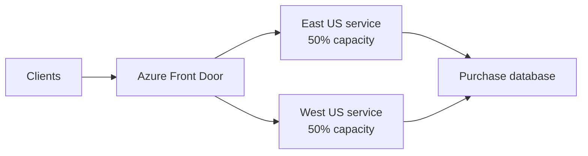
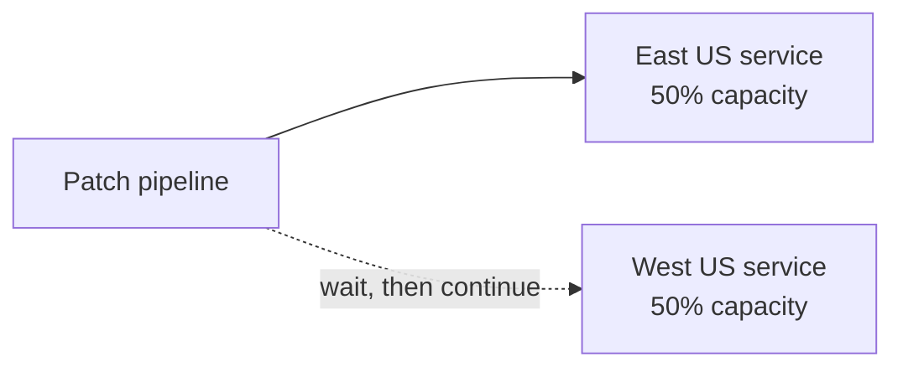
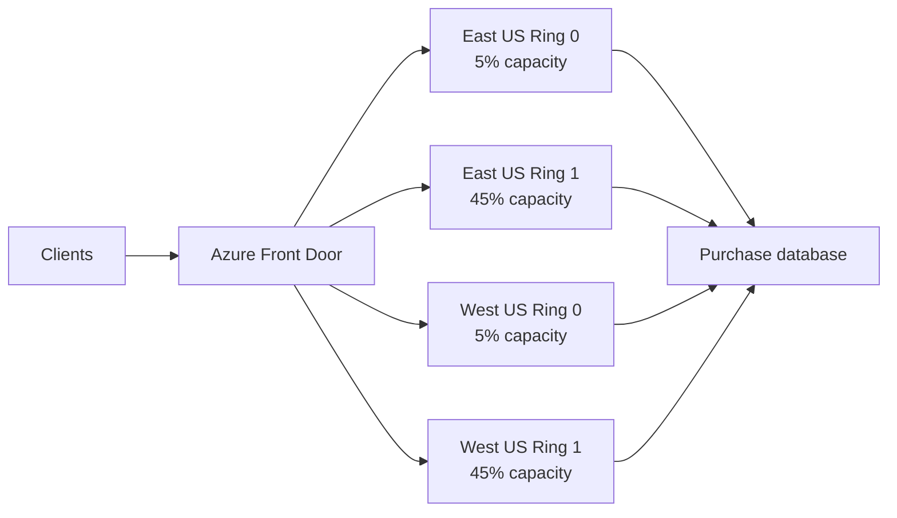
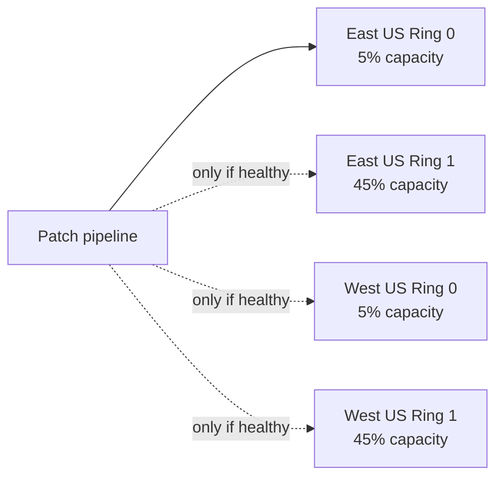
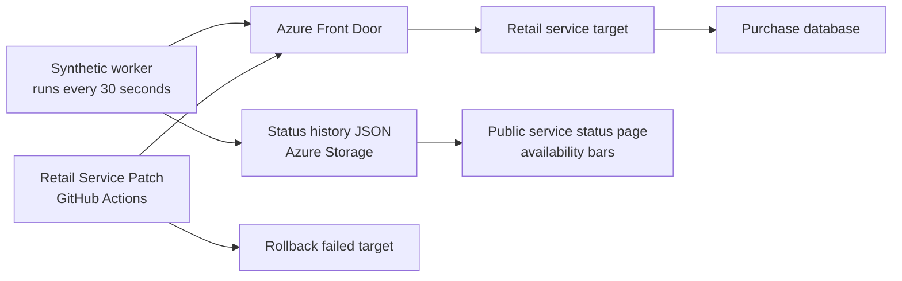

# Multi-Region Retail Service Patch Safety Demo

## Purpose

This demo shows how production observability plus sliced rollout architecture reduces customer impact when a bad retail service patch is released.

The retail service exposes a simple checkout path:

```text
Catalog lookup -> Add to cart -> Purchase
```

The bad patch intentionally breaks only `Purchase`, while catalog and cart still work. This makes the failure realistic: the service is partially healthy, but the customer-critical checkout path is broken.

## Customer Starting Point: Regional Rollout

Many customers already run in multiple regions, but deploy one full region at a time. Metrics may exist at region level, yet detection often happens only after a large customer impact.

### Customer Runtime Flow



### Deployment Flow



### Challenge

If the patch is deployed to East US first and breaks checkout:

```text
Impact target: 50% of production capacity
Detection: regional synthetic or customer failures
Rollback: after failure is detected
Risk: large blast radius before the pipeline stops
```

In the demo, the GitHub workflow is run as:

```text
rollout_mode = current
patch_version = v2-bad
```

Expected result:

```text
Deploy patch to East US
Checkout validation fails on Purchase
Rollback East US
Stop before West US
```

## Improved Setup: Sliced Production Rollout

We help re-architect production capacity into smaller slices while keeping the same total regional capacity. The first production deployment goes to a small slice, then expands only after checkout validation passes.

### Customer Runtime Flow



### Deployment Flow



### Improvement

If the same bad patch breaks checkout:

```text
Impact target: 5% of production capacity
Detection: targeted synthetic checkout validation
Rollback: only the failed slice
Risk: rollout stops before larger rings are exposed
```

In the demo, the GitHub workflow is run as:

```text
rollout_mode = sliced
patch_version = v2-bad
```

Expected result:

```text
Deploy patch to East US Ring 0
Checkout validation fails on Purchase
Rollback East US Ring 0
Stop before East US Ring 1 and West US
```

## Observability Loop

The demo uses synthetic transactions to validate the complete checkout path, not just service uptime.



The public status page shows customer-safe availability:

```text
Catalog
Cart
Checkout
East US
West US
```

It does not expose patch versions, rollback details, synthetic headers, or internal ring names.

## Demo Walkthrough

1. Open the public status page:

   ```text
   https://retail-retaildemo-bjg2ebhydwemckfr.z02.azurefd.net/
   ```

2. Run the current regional rollout:

   ```text
   Retail Service Patch
   rollout_mode = current
   patch_version = v2-bad
   ```

   Message: a bad patch can threaten a full 50% regional target.

3. Run the sliced rollout:

   ```text
   Retail Service Patch
   rollout_mode = sliced
   patch_version = v2-bad
   ```

   Message: the same failure is contained to the first 5% slice.

4. Show the pipeline language:

   ```text
   Build retail service patch image
   Deploy patch and validate checkout health
   Rollback failed rollout target
   Stop patch rollout before wider impact
   ```

## Key Takeaway

Multi-region alone reduces infrastructure risk, but it does not automatically reduce deployment blast radius. Sliced production rollout plus synthetic checkout validation changes the failure mode:

```text
From: detect after a large regional impact
To: detect in a small production slice and stop automatically
```
