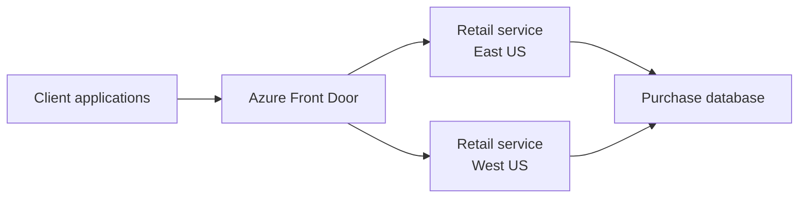
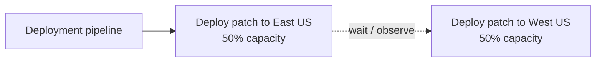
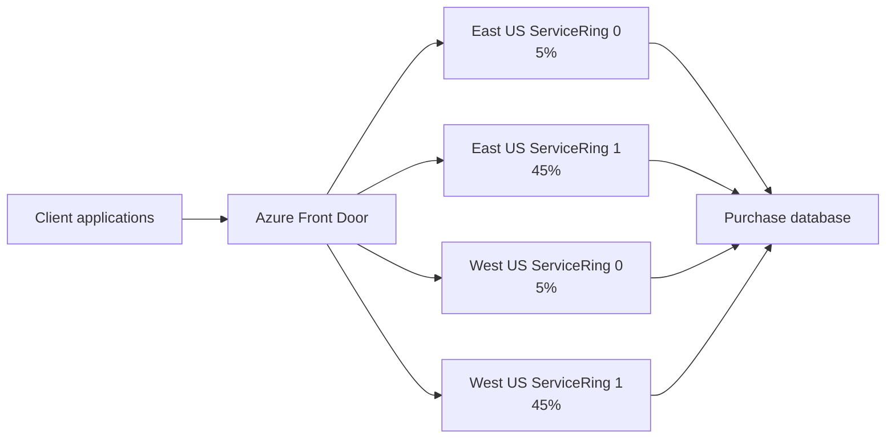
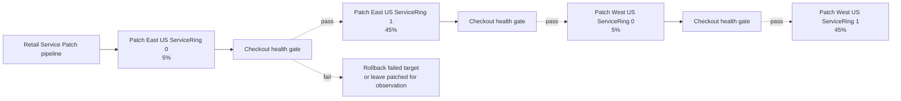
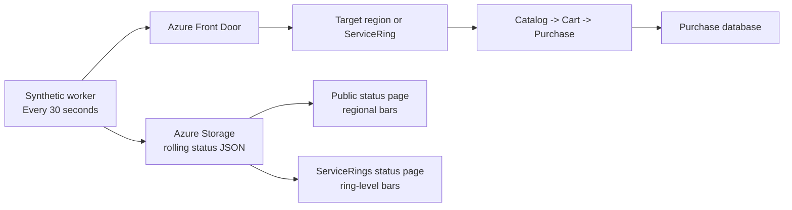
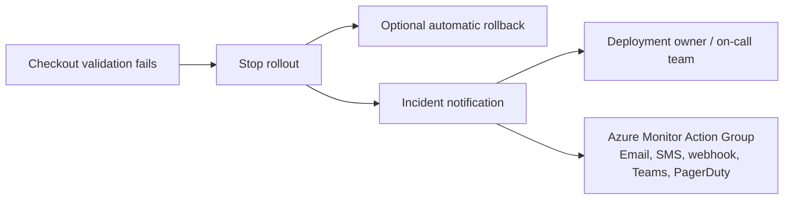

# Production Deployment Reliability Modernization

Reducing deployment blast radius with ServiceRings, checkout-path synthetics, and automated health gates.

## Customer Service Setup

The customer operates a multi-region retail service. Clients use a checkout workflow that depends on service APIs and a database write during purchase.

```text
Catalog lookup -> Add to cart -> Purchase
```

The business-critical risk is not just whether the service is up. A patch can leave catalog and cart healthy while breaking purchase completion.



## Azure Components In The Customer Setup

Current production components:

```text
Azure Front Door
  Global entry point and traffic distribution.

Retail service in East US and West US
  Hosts Catalog, Cart, and Purchase APIs.

Purchase database
  Records completed purchases.

Regional metrics
  Shows service health at broad regional granularity.

Deployment pipeline
  Pushes retail service patches to production regions.
```

## Current Deployment Model

The existing rollout model deploys one full region at a time.

```text
East US = 50% capacity
West US = 50% capacity
```



## Challenges In The Current Model

If a service patch contains a Purchase bug and is deployed to East US first:

```text
Catalog API: healthy
Cart API: healthy
Purchase API: failing
Capacity at risk: 50%
Detection: after regional synthetic or customer checkout failures
Outcome: rollback can repair East US, but the first failure target is large
```

The key challenge is blast radius. Multi-region architecture helps availability, but regional deployment still exposes a large production target to a faulty patch.

## Modernization Added

The modernization splits the same production capacity into ServiceRings and adds checkout-path validation before expanding rollout.

```text
East US ServiceRing 0 = 5%
East US ServiceRing 1 = 45%
West US ServiceRing 0 = 5%
West US ServiceRing 1 = 45%
```

Added capabilities:

```text
ServiceRing-based production topology
Targeted synthetic checkout validation
Patch pipeline health gates
Automatic rollback option
ServiceRings status page
Incident notification hook
```

## Modernized Runtime Architecture

Customer traffic still enters through Azure Front Door, but production capacity is organized into smaller ServiceRings.



## Modernized Deployment Flow

Patch rollout starts with the smallest production ring and proceeds only when checkout validation passes.



## Synthetics Flow

Synthetics validate the customer journey, not just basic uptime.



Every 30 seconds:

```text
1. Synthetic worker calls Azure Front Door.
2. It targets a region or ServiceRing using protected routing.
3. It runs Catalog -> Cart -> Purchase.
4. It records pass/fail by component and target.
5. It writes rolling history to Azure Storage.
6. Status pages render availability bars from the latest history.
```

## Incident Notification Flow

When checkout validation fails during patch rollout, the pipeline stops before wider exposure and raises an incident notification.



Recommended production integration:

```text
Azure Monitor Action Group
  Email, SMS, voice, webhook, Logic App, or incident tool routing.

GitHub Actions notification hook
  Emits incident context and can call a configured webhook.
```

Incident payload should include:

```text
Patch name
Failed region or ServiceRing
Capacity target
Rollback setting
Workflow run URL
```

## Patch Naming

Patch names are intentionally neutral.

```text
Patch 1 = healthy
Patch 2 = contains the Purchase bug
Patch 3 = healthy
```

## Reliability Outcome

| Area | Current regional rollout | Modernized ServiceRing rollout |
| --- | --- | --- |
| First production target | Full region | Small ServiceRing |
| Initial capacity at risk | 50% | 5% |
| Detection signal | Regional health or customer failures | Checkout-path synthetic validation |
| Pipeline behavior | Stop after regional failure | Stop before wider ServiceRings |
| Recovery | Roll back region | Roll back failed ServiceRing |

Key change:

```text
From: detect after a large regional impact
To: detect in a small production ServiceRing and stop automatically
```

## Walkthrough

Public regional status:

```text
https://retail-retaildemo-bjg2ebhydwemckfr.z02.azurefd.net/
```

Internal ServiceRings status:

```text
https://retail-retaildemo-bjg2ebhydwemckfr.z02.azurefd.net/service-rings
```

Regional observation:

```text
Retail Service Patch
rollout_mode = current
patch = Patch 2
rollback_on_failure = false
```

ServiceRing observation:

```text
Retail Service ServiceRing Patch Deploy
service_ring = eastus-ring0
patch = Patch 2
```

Production-safe rollout:

```text
Retail Service Patch
rollout_mode = service-rings
patch = Patch 2
rollback_on_failure = true
```
